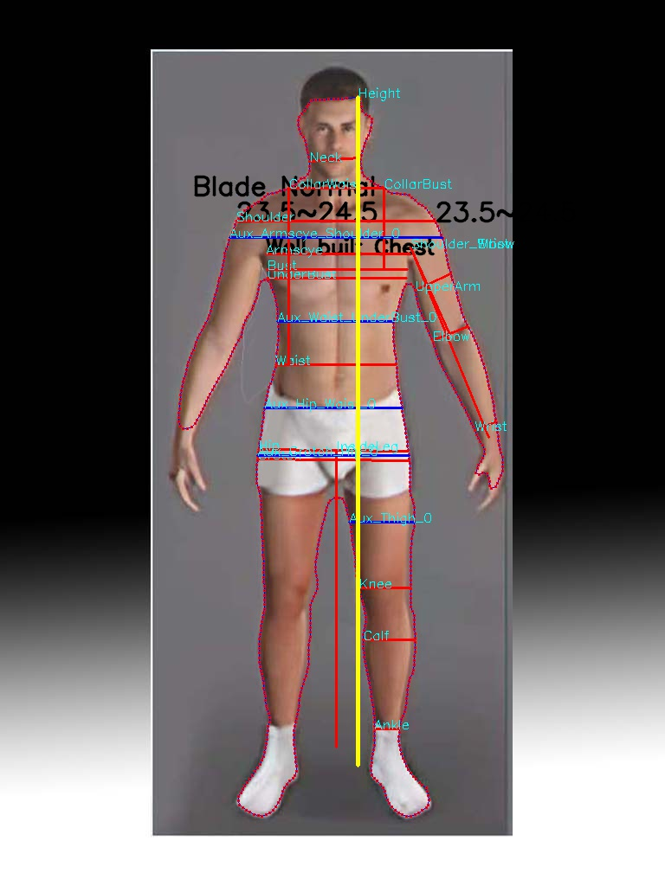
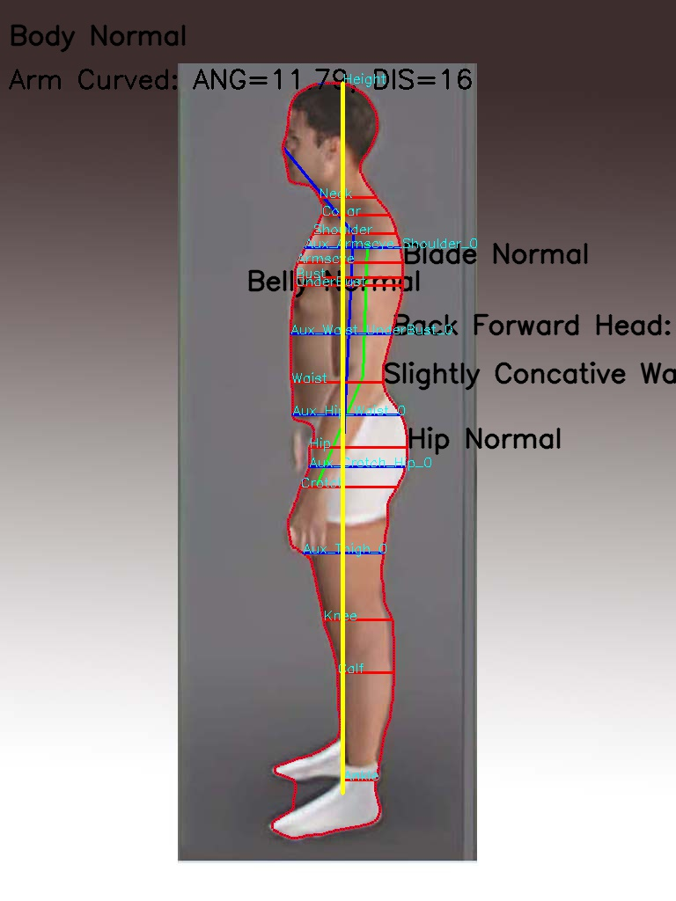

## Project Overview
The Body Measurement System is a software application developed using OpenPose for body pose estimation and specific body measurement algorithms. The backend of the system is built using Flask and deployed on Amazon Web Services (AWS). The system allows users to capture body measurements accurately using computer vision technology and provides valuable insights for various applications such as fitness tracking, virtual fitting rooms, and health monitoring.

## Technologies Used
OpenPose: for body pose estimation
Flask: backend development
Amazon Web Services (AWS): deployment
Specific Body Measurement Algorithms: for precise body measurements
Features
Body Pose Estimation: Utilizes OpenPose for accurate body pose estimation.
Body Measurement Algorithms: Incorporates specific algorithms for precise body measurements.
Flask Backend: Implements Flask for the backend server.
AWS Deployment: Hosted on Amazon Web Services for scalability and reliability.
Future Work
Model Optimization: Enhance the performance and accuracy of the body measurement models.
Amazon SageMaker Pipeline Configuration: Set up a pipeline on Amazon SageMaker for automated model training and deployment.
## Installation
Clone the project repository from (https://github.com/aitechguy0105/body-measurement-system.git).
Install necessary dependencies using pip install -r requirements.txt.
Set up the project environment and configuration files.
Run the Flask backend server using python app.py.
## Usage
Access the application through the provided endpoint after deploying on AWS.
Follow the instructions to capture body measurements using the system.
Retrieve and utilize the accurate body measurements generated by the system.

## Contact

For support or inquiries related to this project, please leave issues

Thank you for using the Body Measurement System!